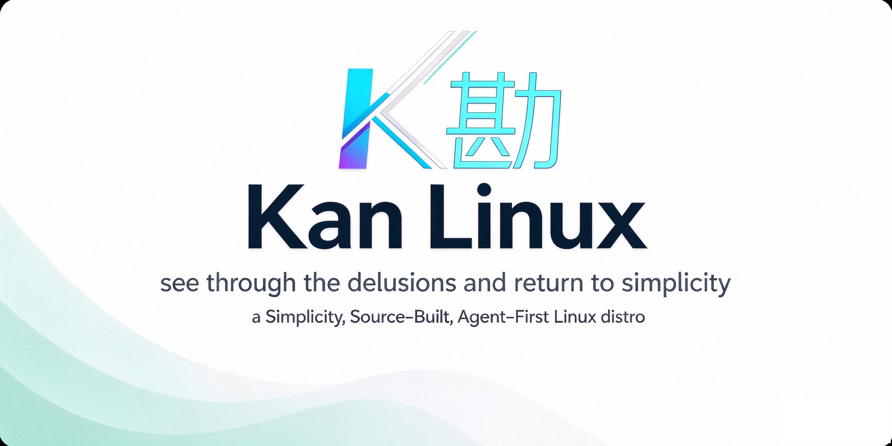

<p align="center">
  <picture>
    <source
      media="(prefers-color-scheme: dark)"
      srcset="assets/kanlinux-banner.png"
    />
    <source
      media="(prefers-color-scheme: light)"
      srcset="assets/kanlinux-banner.png"
    />
    
  </picture>
</p>

<div align="center">
<b>a Simplicity, Source-built, Agent-First Linux distro</b>
</div>

<br>

**Kan-Linux**(or KanLinux) is a **Simplicity**, **Source‑Built**, **Agent‑First** Linux distribution\. The name **Kan(勘)** derives from *Instructions for Practical Living* by [Wang Yangming](https://en.wikipedia.org/wiki/Wang_Yangming), representing the philosophy of breaking through technical obscurations and returning to the system’s original simplicity\. The name **Kan(勘)** also stands for "*see through the delusions and return to simplicity*".


## Design Principles
- Simplicity — Eliminate overly complex wrapper layers and overengineering, following the core philosophy of [ggml/llama.cpp](https://github.com/ggml-org/llama.cpp). Not dependent on any existing Linux distribution.
- Monorepo — Drawing lessons from existing Linux distributions and the **highly sophisticated [Yocto](https://www.yoctoproject.org/)** Project, the project uses an AOSP-style single-repository architecture. All source code is stored and hosted in one single code repository to simplify development, build and maintenance work.
- Source-Built — The entire OS and all components are built from source.
- llama.cpp-First — Built-in native llama.cpp edge inference engine for local AI deployment.
- Agent-First & AI-native security audit pipeline — Supports AI agents to autonomously compile, deploy, install components, run system checks and resolve issues. Kan-Linux embeds LLM-based source-level security audit (GLM-5.3 and others) as a mandatory gate before compilation. Security is shifted from "binary post-scanning" to source pre-admission auditing.


## Differences and Connections with Omarchy
- Omarchy targets end users, delivering an out-of-the-box complete desktop system, with **visual polish as one of its core goals**.
- **Kan‑Linux targets Linux professional programmers and Linux distribution builders**, providing a neutral Wayland underlying graphics platform. Its core goals are **controllability**, **auditability**(no black-box within the OS), **modularity and reproducible builds**, and **visual polish is not a project objective**.
- Kan‑Linux draws inspiration from [Omarchy’s desktop shell](https://github.com/kan-linux/omarchy), and integrates it as our optional early default desktop. We port this shell as an upper-layer UI example to show the capabilities of the Kan-Linux platform. Even if we remove or disable the Omarchy shell in the future, the whole system and graphics infrastructure can still run fully and independently.
- Omarchy is based on the upstream Arch Linux distribution, while Kan-Linux is built completely from scratch and **does not rely on any upstream Linux distribution**.

## Roadmap

- PoC via QEMU virtual machine (stage-1, done)
- Add greeter and full desktop environment in QEMU virtual machine (stage-2.1)
- Enable Kan-Linux to run on physical x86-64 desktop PCs (stage-2.2)
- Enable Kan-Linux to run on physical x86-64 laptops (stage-2.3)
- Add AI-Agent within the desktop environment in QEMU virtual machine (stage-2.4)
- Enable/test/verify AI-Agent within the desktop environment in physical x86-64 PCs/laptops (stage-2.5)
- AArch64 laptops (stage-3)


## Documentation

#### How to fetch codes

```bash

git clone --recurse-submodules https://github.com/kan-linux/kan.git

```

#### Screenshots and LiveISO

Please refer to https://github.com/kan-linux/kan/releases/tag/v0.2.6


#### Development

- [How to build(TBD)](/docs/build.md)


## Contributing

- Contributors can open PRs
- Collaborators will be invited based on contributions
- Maintainers can push to branches in the `kan` repo and merge PRs into the `master` branch
- Any help with managing issues, PRs and projects is very appreciated!
- Read the [CONTRIBUTING.md](CONTRIBUTING.md) for more information

  
## Acknowledgements
- Inspired by [Omarchy Linux](https://github.com/omacom/omarchy)
- Thanks to [LFS (Linux From Scratch)](https://www.linuxfromscratch.org/)
- Thanks to [llama.cpp](https://github.com/ggml-org/llama.cpp)
- Thanks to the entire Linux community(various tech orgs, such as Redhat(RHEL/Fedora/QEMU), SPI(Debian), Linux Foundation, Linaro, Canonical(Ubuntu), System76(Pop!_OS)... and tech stacks)
- Special thanks to the AI assistant for extensive technical discussions, architectural advice, and writing assistance throughout the development of Kan-Linux
